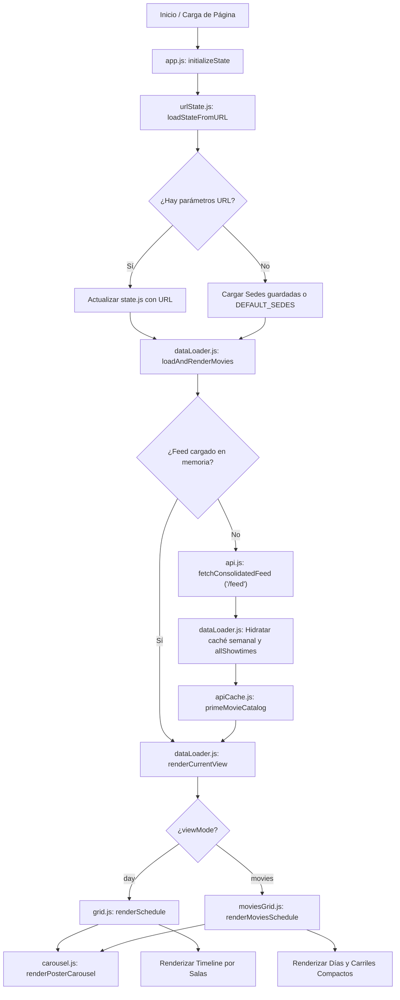
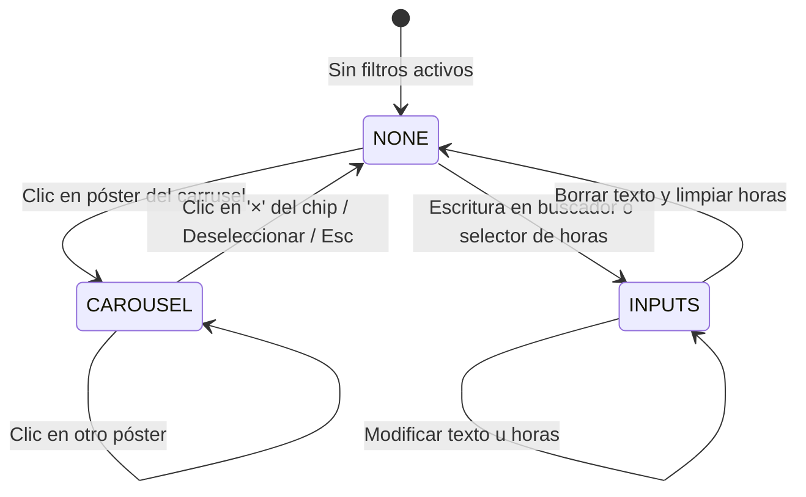

# Arquitectura del Sistema y Flujo Global

Este documento describe la arquitectura general de **Cineteca Schedule Grid**, su ciclo de vida, eventos del sistema y sincronización de datos.

---

## 🏗️ Diagrama de Flujo de Datos

---

## 🖥️ Modos de Visualización: Día vs. Películas

La aplicación soporta dos modos de renderizado interactivos controlados por `state.viewMode`:

| Característica | Modo por Día (`day`) | Modo Películas (`movies`) |
|---|---|---|
| **Módulo UI** | [`js/grid.js`](ui/grid.md) & [`css/grid.css`](styles/styles.md) | [`js/moviesGrid.js`](ui/moviesGrid.md) & [`css/moviesGrid.css`](styles/styles.md) |
| **Alcance Temporal** | 1 fecha específica (`state.currentDate`). | Ventana continua de 7-8 días precargada en memoria. |
| **Organización Visual** | Por **Sede** $\rightarrow$ **Salas** (ordenadas numéricamente). | Por **Día** $\rightarrow$ **Carriles compactos** (#1, #2...). |
| **Algoritmo de Disposición** | Filas fijas por sala; bloques según duración y horario. | Empaquetado voraz (*lane packing*) sin solapamientos entre salas. |
| **Altura de Bloque** | Estándar (40px) con título y horario. | Compacta (16px, 40% de altura) para alta densidad visual. |
| **Selector de Fecha** | Visible (`#dateSelector` con botones `<` `>` y datepicker). | Oculto (la cartelera cubre todos los días continuos). |
| **Fuente de Datos** | `state.movieData` vía `getCurrentMovieData()`. | `state.multiDayData` (`{ [dateKey]: { [sedeId]: Movie[] } }`). |
| **Parámetro URL** | Parámetro omitido o implícito (`date=YYYY-MM-DD`). | Parámetro explícito `view=movies`. |

---

## 🔄 Ciclo de Vida de la Aplicación

1. **Bootstrap (`app.js`)**:
   - Se ejecuta en el evento `DOMContentLoaded`.
   - Inicializa subsistemas: `visited.js`, `tooltip.js`, `posterTooltip.js`, `modal.js`, `helpModal.js`, `carouselFilterChip.js`.
   - Lee la URL (`urlState.js`) o LocalStorage (`cinetkSelectedSedes`).
   - Sincroniza controles de vista (`#viewModeDay` y `#viewModeMovies`).
   - Dispara la carga inicial con `dataLoader.js:loadAndRenderMovies()`.

2. **Carga Única y Consolidada (`dataLoader.js:ensureFeedLoaded`)**:
   - Realiza **1 sola llamada HTTP** al endpoint `/feed` del worker `cinetk`.
   - Recibe el catálogo semanal completo con todas las películas, funciones para las 3 sedes y 7-8 días, salas resueltas inmutables y fichas técnicas completas.
   - Precalcula `allShowtimes` para cada película cruzando todos los días y sedes.
   - Puebla inmediatamente `apiCache.js` mediante `primeMovieCatalog` con sinopsis, créditos, poster stills y tráilers.
   - Hidrata `state.cachedData` y `state.multiDayData` para renderizado instantáneo.

3. **Renderizado Condicional Instantáneo (`renderCurrentView`)**:
   - `dataLoader.js:renderCurrentView()` actúa como distribuidor de vista a 0 ms de latencia:
     - Si `state.viewMode === 'movies'`: invoca `renderMoviesSchedule(state.multiDayData)`.
     - Si `state.viewMode === 'day'`: invoca `renderSchedule(getCurrentMovieData())`.
   - Garantiza que `#posterCarousel` permanezca visible y sincronizado.

4. **Interacción y Filtrado Sin Latencia**:
   - Cambios de fecha en el selector: **instantáneos** (0 peticiones HTTP).
   - Alternar sedes (checkboxes): **instantáneo** (0 peticiones HTTP).
   - Alternar entre vista por Día y Películas: **instantáneo** (0 peticiones HTTP).
   - Abrir y navegar fichas técnicas en el modal: **instantáneo** (0 peticiones HTTP).
   - Puede filtrar por texto, rango de horas o clic en póster.
   - La exclusión mutua la gestiona `filterLock.js`.
   - La selección de películas para armar itinerario detecta traslapes temporales y de fecha en `selection.js`.

5. **Sincronización Bidireccional (`urlState.js`)**:
   - Cada cambio de fecha, sede, modo de visualización (`view=movies`) o filtro actualiza los query params en la URL (`history.replaceState`) sin recargar la página.
   - Al navegar en el historial (`popstate`), se detecta si cambió la fecha o el modo (`result.viewModeChanged`) para sincronizar la UI y recargar la vista correcta.

---

## 🔒 Máquina de Estados del Filtro (`filterLock.js`)

Para evitar inconsistencias en la interfaz, existe un sistema de bloqueo mutuo entre el carrusel de pósters y los inputs de filtro de texto/horario:

- **`FILTER_LOCKS.NONE`**: Todos los controles interactivos están habilitados.
- **`FILTER_LOCKS.CAROUSEL`**:
  - Un póster específico (`state.carouselFilterFilmId`) filtra la cuadrícula.
  - Los campos de texto y filtros de hora quedan deshabilitados visual y funcionalmente (`.filter-input--locked`).
  - Se muestra el chip flotante `carouselFilterChip.js` con el botón para quitar el filtro.
- **`FILTER_LOCKS.INPUTS`**:
  - Se ingresó texto en el buscador o un rango horario.
  - El carrusel de pósters pasa a modo atenuado (`.poster-carousel--inputs-locked`).

---

## 📡 Bus de Eventos Personalizados (`CustomEvent`)

La comunicación desacoplada entre módulos utiliza eventos disparados en `document`:

| Evento | Origen | Detalle (`event.detail`) | Propósito |
|---|---|---|---|
| `posterCarousel:applyFilter` | `carousel.js` | `{ filmId, title, forceOpenInfo }` | Notifica que se seleccionó una película del carrusel para filtrar. |
| `posterCarousel:clearFilter` | `carousel.js` | `{ filmId }` | Notifica que se deseleccionó la película del carrusel. |
| `filters:updated` | `filters.js` | Ninguno | Notifica que los filtros cambiaron para actualizar conteos, carrusel y chips. |
| `filterLock:changed` | `filterLock.js` | `{ lock }` | Notifica cambio de bloqueo (`carousel`, `inputs`, o `null`). |

---

## 💾 Capas de Almacenamiento y Caché Multi-Nivel

1. **Persistencia en la Nube (Cloudflare R2 Bucket - `cinetk`)**:
   - `movies/{filmId}.json`: Fichas técnicas inmutables de películas en cartelera.
   - `schedules/{version}/{cinemaId}/{date}.json`: Carteleras precalculadas cada hora (8:00 AM a 9:00 PM CDMX).
   - Purga automática (Garbage Collection): elimina películas que salen de cartelera y fechas pasadas.

2. **Caché en Cloudflare Edge (CDN)**:
   - Cabeceras `s-maxage=3600` para carteleras y `s-maxage=86400` para detalles de películas.
   - Latencia de entrega perimetral: **5 - 15 ms**.

3. **`state.cachedData` (`cache.js`)**:
   - Estructura: `{ [YYYY-MM-DD]: { [sedeId]: { data, date } } }`
   - Almacena en memoria las respuestas de carteleras durante la sesión del navegador.

4. **Caché en Memoria de Fichas Técnicas (`apiCache.js`)**:
   - `movieDetailsCache`, `movieImageCache`, `movieTrailerCache` (TTL: 1 hora).

5. **LocalStorage del Navegador**:
   - `cinetkSelectedSedes`: Array serializado con IDs de sedes activas (`["003","002"]`).
   - `cinetkVisitedMovies`: Set serializado con IDs únicos de funciones inspeccionadas.

---

## ☁️ Capa de Infraestructura: Cloudflare Workers

La aplicación puede alimentarse de dos opciones de Workers serverless:
- **`cinetkv2` (Legacy Live Proxy)**: Scrapeo y resolución en vivo bajo demanda.
- **`cinetk` (R2 Persisted & Cron Pipeline)**: Pipeline automatizado con persistencia en R2 y latencia mínima.
Para más detalles sobre endpoints, configuración y despliegue con Wrangler, consulta [Cloudflare Worker & Wrangler](infrastructure/worker.md).

