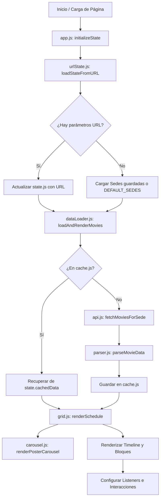
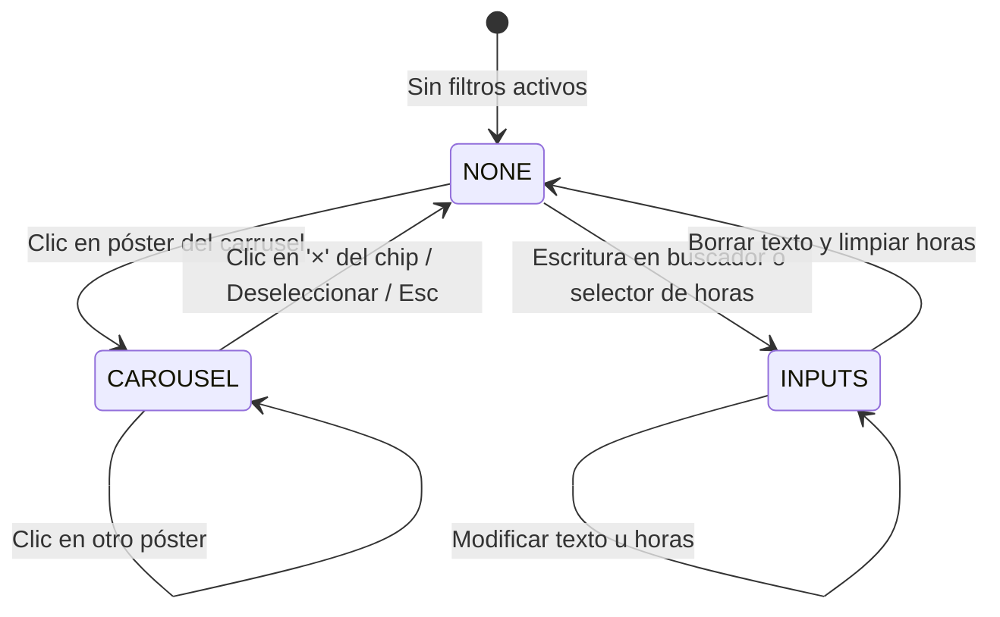

# Arquitectura del Sistema y Flujo Global

Este documento describe la arquitectura general de **Cineteca Schedule Grid**, su ciclo de vida, eventos del sistema y sincronización de datos.

---

## 🏗️ Diagrama de Flujo de Datos

---

## 🔄 Ciclo de Vida de la Aplicación

1. **Bootstrap (`app.js`)**:
   - Se ejecuta en el evento `DOMContentLoaded`.
   - Inicializa subsistemas: `visited.js`, `tooltip.js`, `posterTooltip.js`, `modal.js`, `helpModal.js`, `carouselFilterChip.js`.
   - Lee la URL (`urlState.js`) o LocalStorage (`cinetkSelectedSedes`).
   - Dispara la carga inicial con `dataLoader.js:loadAndRenderMovies()`.

2. **Carga y Renderizado de Datos (`dataLoader.js` & `grid.js`)**:
   - Para cada sede activa (`state.activeSedes`), verifica si existe en la caché en memoria (`cache.js`).
   - Si no existe, invoca `api.js` que consulta el proxy Cloudflare Worker `cinetkv2`.
   - Los datos se normalizan mediante `parser.js`.
   - `grid.js` calcula el rango dinámico de horas (`calculateTimeRange`) y renderiza las salas ordenadas.
   - `carousel.js` extrae películas únicas con póster y renderiza el carrusel sticky.

3. **Interacción y Filtrado**:
   - El usuario puede filtrar por texto, rango de horas o clic en póster.
   - La exclusión mutua la gestiona `filterLock.js`.
   - La selección de películas para armar itinerario detecta traslapes temporales en `selection.js`.

4. **Sincronización Bidireccional (`urlState.js`)**:
   - Cada cambio de fecha, sede o filtro actualiza los query params en la URL (`history.replaceState`) sin recargar la página.
   - Al navegar en el historial (`popstate`), se recarga el estado desde la URL.

---

## 🔒 Máquina de Estados del Filtro (`filterLock.js`)

Para evitar inconsistencias en la interfaz, existe un sistema de bloqueo mutuo entre el carrusel de pósters y los inputs de filtro de texto/horario:

- **`FILTER_LOCKS.NONE`**: Todos los controles interactivos están habilitados.
- **`FILTER_LOCKS.CAROUSEL`**:
  - Un póster específico (`state.carouselFilterFilmId`) filtra la cuadrícula.
  - Los campos de texto y filtros de hora quedan deshabilitados visual y funcionalmente (`.filter-input--locked`).
  - Se muestra el chip flotante `carouselFilterChip.js` con el botón para quitar el filtro.
- **`FILTER_LOCKS.INPUTS`**:
  - Se ingresó texto en el buscador o un rango horario.
  - El carrusel de pósters pasa a modo atenuado (`.poster-carousel--inputs-locked`).

---

## 📡 Bus de Eventos Personalizados (`CustomEvent`)

La comunicación desacoplada entre módulos utiliza eventos disparados en `document`:

| Evento | Origen | Detalle (`event.detail`) | Propósito |
|---|---|---|---|
| `posterCarousel:applyFilter` | `carousel.js` | `{ filmId, title, forceOpenInfo }` | Notifica que se seleccionó una película del carrusel para filtrar. |
| `posterCarousel:clearFilter` | `carousel.js` | `{ filmId }` | Notifica que se deseleccionó la película del carrusel. |
| `filters:updated` | `filters.js` | Ninguno | Notifica que los filtros cambiaron para actualizar conteos, carrusel y chips. |
| `filterLock:changed` | `filterLock.js` | `{ lock }` | Notifica cambio de bloqueo (`carousel`, `inputs`, o `null`). |

---

## 💾 Capas de Almacenamiento y Caché

1. **`state.cachedData` (`cache.js`)**:
   - Estructura: `{ [YYYY-MM-DD]: { [sedeId]: { data, date } } }`
   - Almacena en memoria las respuestas completas de carteleras durante la sesión.
   - Se limpia periódicamente cada hora y purga datos con más de 7 días (`MAX_CACHE_DAYS`).

2. **Caché en Memoria de Fichas Técnicas (`apiCache.js`)**:
   - `movieDetailsCache`: Map con sinopsis, directores, fichas técnicas (TTL: 1 hora).
   - `movieImageCache`: Map con URLs de pósters en alta resolución.
   - `movieTrailerCache`: Map con URLs de tráilers de YouTube.
   - Se vacía (`clearAPICache()`) cada vez que se cambia de fecha.

3. **LocalStorage del Navegador**:
   - `cinetkSelectedSedes`: Array serializado con IDs de sedes activas guardadas por el usuario (e.g. `["003","002"]`).
   - `cinetkVisitedMovies`: Set serializado con IDs únicos de funciones que el usuario ya inspeccionó (`sedeId-sala-horario-titulo`).

---

## ☁️ Capa de Infraestructura: Cloudflare Worker

Para resolver las restricciones de CORS y homogeneizar el formato de datos de la Cineteca Nacional, la aplicación utiliza un proxy serverless en **Cloudflare Workers** (`cinetkv2`).
Para más detalles sobre endpoints, configuración y despliegue con Wrangler, consulta [Cloudflare Worker & Wrangler](infrastructure/worker.md).
