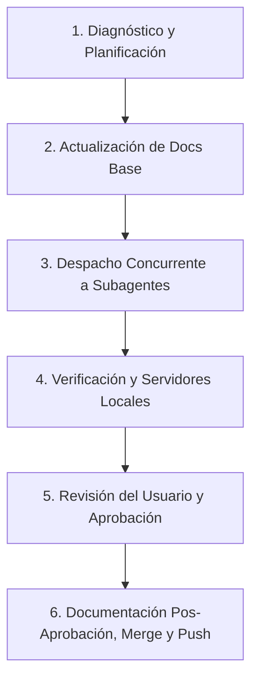

# Protocolo de Coordinación: Agente Coordinador y Subagentes

Este documento establece el protocolo estándar de pair programming y trabajo distribuido con agentes de IA en este repositorio. Define las reglas operativas, el ciclo de vida de tareas en paralelo y la arquitectura de trabajo basada en Git worktrees aislados.

---

## 🏛️ Roles y Responsabilidades

### 1. Agente Coordinador (Supervisor)
- **Mantener el contexto limpio**: No ejecuta refactors masivos ni implementaciones complejas en su contexto principal.
- **Planificación y desglose**: Divide los requerimientos del usuario en tareas ortogonales e independientes.
- **Asignación a subagentes**: Despacha a cada subagente en un worktree aislado (`Workspace: 'branch'`), asignándole un rol específico, instrucciones claras y un **puerto local único y exclusivo**.
- **Inspección de código (`code review`)**: Antes de cualquier merge, inspecciona los `git diff` de cada subagente para validar que no haya código extraño, regresiones, o incompatibilidades.
- **Integración secuencial**: Resuelve cualquier solapamiento o conflicto entre ramas e integra los cambios ordenadamente en la rama base (`staging` o `main`).
- **Limpieza de recursos**: Cierra procesos huérfanos, prunea worktrees terminados y mata subagentes inactivos.

### 2. Subagentes Especialistas
- **Lectura preliminar obligatoria**: Antes de escribir una sola línea de código, deben leer los documentos pertinentes en `docs/` para no reinventar utilidades ni violar contratos existentes.
- **Aislamiento**: Trabajan en su propio worktree ramificado sin interferir con otros agentes.
- **Verificación autónoma**: Validan su implementación con pruebas automatizadas y sirviendo la aplicación en su puerto asignado (`python -m http.server <puerto>`).
- **Regla de Oro**: **PROHIBIDO hacer `git commit`, `git merge` o alterar `docs/`** hasta que el usuario o el coordinador hayan revisado y aprobado la solución en el puerto de prueba.
- **Documentación concisa pos-aprobación**: Tras recibir la aprobación, actualizan únicamente las secciones indispensables de `docs/` y crean un commit con mensaje convencional (`Conventional Commits`).

---

## 🔄 Flujo de Trabajo en 6 Fases

### Fase 1: Diagnóstico y Planificación
1. El coordinador revisa `git status`, `git branch` y `git log` para comprender el estado actual de la rama de trabajo.
2. Identifica si existen cambios recientes sin documentar en `docs/` antes de ramificar.

### Fase 2: Actualización de Docs Base (si aplica)
- Si hay código en la rama principal que no fue registrado en `docs/`, se delega a un subagente de documentación la actualización inmediata en el árbol base.
- Se hace commit de la documentación base para que todas las nuevas ramas hereden la documentación al día.

### Fase 3: Despacho a Subagentes en Paralelo
Al invocar subagentes mediante `invoke_subagent`:
- **Modelo**: Gemini Flash / inherit (alta velocidad y capacidad analítica).
- **Workspace**: `'branch'` (crea un worktree aislado en `.system_generated/worktrees/`).
- **Asignación Explícita de Puertos**: Cada subagente recibe un puerto único para su servidor local (ej. `5501`, `5502`, `5503`, `5511`, `5512`). El puerto `5500` se reserva para el coordinador con la versión estable actual.
- **Prompt estructurado**:
  1. Enlaces a docs obligatorios.
  2. Requerimiento funcional conciso.
  3. Archivos candidatos a modificar.
  4. Instrucción de servidor local con puerto explícito.
  5. **Regla de No-Commit / No-Docs** hasta aprobación.

### Fase 4: Verificación y Reporte de Puertos
- Cada subagente implementa su solución, corre pruebas automatizadas (`node scratch/...` o scripts unitarios) y levanta su servidor local con `python -m http.server <puerto>`.
- Reporta al coordinador:
  - Enlace local de prueba (ej. `http://localhost:5511/?view=movies`).
  - Resumen de archivos modificados.
  - Resultados de las pruebas de verificación.

### Fase 5: Revisión del Usuario e Inspección del Coordinador
- El coordinador presenta los enlaces al usuario para su interacción directa en el navegador.
- El coordinador realiza un `git diff` sobre el worktree de cada subagente para auditar:
  - Limpieza del código y ausencia de librerías externas innecesarias.
  - Compatibilidad entre módulos que toquen archivos compartidos (ej. `moviesGrid.js`, `utils.js`).
  - Si se requiere algún ajuste estético o funcional, el coordinador reenvía la retroalimentación al subagente mediante `send_message`.

### Fase 6: Merge Secuencial, Documentación y Push
1. Tras la aprobación, se instruye a cada subagente a añadir notas concisas en `docs/` si su cambio alteró contratos o comportamientos públicos.
2. Cada subagente genera su commit convencional (`feat:`, `fix:`, `style:`).
3. El coordinador ejecuta los merges secuenciales hacia la rama base (`git merge <rama> --no-edit`), resolviendo armoniosamente cualquier solapamiento.
4. Se replica el avance hacia la rama de trabajo principal (ej. `git -C <repo_path> merge <worktree_branch> --ff-only`).
5. Se eliminan los subagentes (`manage_subagents kill_all`), se podan los worktrees (`git worktree prune`) y se limpian las ramas temporales.
6. Se realiza el push final a la rama remota (`git push origin <rama>`).

---

## ⚡ Consejos de Eficiencia y Permisos

1. **Modo Full Permiso (YOLO / Auto-run)**:
   - Para evitar pausar la ejecución en cada comando de terminal (`run_command`), activa el modo **Auto-run / YOLO** o marca la casilla *"Always allow"* en el modal de confirmación del IDE. Esto permite a los subagentes ejecutar sus pruebas y levantar sus servidores de forma completamente desatendida.
2. **Puertos sin colisiones**:
   - Asignar siempre bloques de puertos distantes de los puertos estándar del sistema: `5500` (coordinador), `5501`–`5509` (lote 1 de subagentes), `5511`–`5519` (lote 2 de subagentes).
3. **Docs concisos**:
   - No sobrecargar la documentación con cambios puramente cosméticos de CSS. Documentar únicamente nuevos parámetros, flujos de datos, APIs de utilidades y componentes nuevos.
