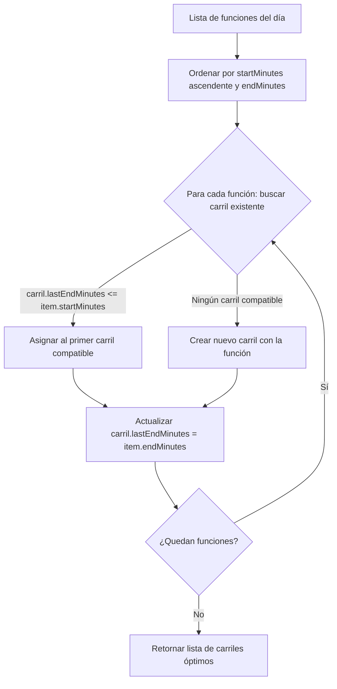

# Componente: Cuadrícula Multi-Día de Películas (`js/moviesGrid.js`)

## 📌 Propósito y Resumen
Es el componente de visualización para el modo **"Ver películas"** (Multi-día). Presenta la cartelera completa a lo largo de una ventana de **8 días** (fecha actual y los 7 días posteriores) para las sedes seleccionadas.

A diferencia del modo tradicional por día ([`grid.js`](grid.md)), que organiza las funciones en filas por sala de cada sede para una fecha específica, este componente:
1. Agrupa la cartelera en bloques cronológicos por día (`.day-container`).
2. Empaqueta todas las funciones del día en un número mínimo óptimo de **carriles temporales** (`.movies-lane`) mediante un algoritmo voraz de empaquetado de intervalos (*greedy interval scheduling*).
3. Utiliza **bloques de película compactos** (`.movie-block--compact`) con altura reducida al 40% (16px) y estilo condensado, maximizando la densidad de información sin generar solapamientos visuales.

---

## 📦 Dependencias e Interacciones
- **Importa**:
  - [`state.js`](../state/state.md): `state`, `setStartEndHours`.
  - [`config.js`](../state/config.md): `SEDES`, `HOUR_WIDTH`.
  - [`utils.js`](../interaction/utils.md): `minutesToPosition`.
  - [`filters.js`](../interaction/filters.md): `applyFilters`, `hasActiveFilters`, `countSedeMoviesAndShowtimes`, `formatMovieAndShowtimeCounts`.
  - [`visited.js`](../state/visited.md): `isMovieVisited`.
  - [`movieUtils.js`](../data/movieUtils.md): `getEnrichedShowtime`.
  - [`carousel.js`](carousel.md): `renderPosterCarousel`, `selectFilmInCarousel`.
  - [`tooltip.js`](tooltip.md): `closeTooltip`.
- **Consumido por**: [`dataLoader.js`](../data/dataLoader.md) a través de la función de renderizado condicional `renderCurrentView()`.

---

## 📐 Algoritmo de Empaquetado en Carriles (*Lane Packing*)

Para evitar que las funciones de múltiples salas y sedes colisionen visualmente al combinarse en un mismo día, se utiliza la función `packMoviesIntoLanes(showtimesList)`:



### Principios del empaquetado:
- **Orden cronológico**: Se ordena la lista por `startMinutes` ascendente; en caso de empate, por `endMinutes`.
- **Reutilización de carriles**: Una función se coloca en el primer carril cuyo `lastEndMinutes <= item.startMinutes`.
- **Minimización de espacio vertical**: Se crea un nuevo carril únicamente cuando todas las pistas existentes se encuentran ocupadas en ese intervalo horario.

---

## ⏱️ Eje Temporal y Escala Unificada

A fin de que todos los días compartan una cuadrícula horizontal perfectamente alineada:
- **`calculateGlobalTimeRange(multiDayData)`**: Itera sobre todas las funciones de todas las fechas y sedes cargadas para determinar la hora mínima (`minMinutes`) y máxima (`maxMinutes`).
- **Límites globales**: Establece `startHour = Math.max(0, Math.floor(minMinutes / 60))` y `endHour = Math.min(24, Math.ceil(maxMinutes / 60))`. Posee un tope estricto a las 24:00 (1440 min) para garantizar que anomalías de duración en datos de origen no desborden la cuadrícula. Si no hay funciones, utiliza el rango predeterminado `12:00` a `23:00`.
- **Sincronización de estado**: Invoca `setStartEndHours(startHour, endHour)` en [`state.js`](../state/state.md).
- **Marcadores de tiempo (`renderTimeAxis`)**:
  - Dibuja etiquetas horarias (`.time-label`) con intervalo de 1 hora (o 2 horas si el rango excede las 12 horas).
  - Genera líneas de cuadrícula verticales cada 30 minutos (`.time-grid-line.half-hour`) y cada hora (`.time-grid-line.hour`).

---

## ⚙️ Funciones Exportadas e Internas

### Funciones Exportadas

#### `renderMoviesSchedule(multiDayData)`
- **Firma**: `renderMoviesSchedule(multiDayData: Object): void`
- **Flujo de Ejecución**:
  1. Extrae y unifica en `combinedMoviesBySede` todas las películas de las sedes activas a través de los 8 días para alimentar el carrusel de pósters superior con `renderPosterCarousel(combinedMoviesBySede)`.
  2. Filtra los días que contienen funciones para sedes activas (`daysWithMovies`).
  3. Si no hay películas para mostrar, presenta un mensaje de estado amigable en `#scheduleContainer`.
  4. Calcula el rango horario global con `calculateGlobalTimeRange()` y fija las horas en `state.js`.
  5. Genera la estructura HTML iterando por cada fecha disponible y aplicando `packMoviesIntoLanes()`.
  6. Inserta el marcado en `#scheduleContainer` y configura listeners de interacción mediante `setupCompactBlockInteractions()`.
  7. Si existen filtros activos en el estado (`hasActiveFilters()`), ejecuta `applyFilters()`.

#### `formatDayHeaderDate(dateKey)`
- **Firma**: `formatDayHeaderDate(dateKey: string): string`
- **Descripción**: Convierte una clave de fecha `YYYY-MM-DD` en un encabezado textual en español.
- **Ejemplo**: `'2026-09-01'` $\rightarrow$ `'Martes, 1 de septiembre de 2026'`.

#### `calculateGlobalTimeRange(multiDayData)`
- **Firma**: `calculateGlobalTimeRange(multiDayData: Object): { startHour: number, endHour: number }`
- **Descripción**: Determina el intervalo horario mínimo y máximo que abarca todas las funciones programadas en el conjunto de datos multi-día, limitando `endHour` a un máximo estricto de 24:00.

#### `packMoviesIntoLanes(showtimesList)`
- **Firma**: `packMoviesIntoLanes(showtimesList: Array<Object>): Array<{ lastEndMinutes: number, items: Array<Object> }>`
- **Descripción**: Algoritmo de empaquetado voraz que distribuye las funciones de un día en el menor número de carriles horizontales posible sin colisiones de horario.

### Funciones Internas

#### `renderTimeAxis(startHour, endHour)`
- **Firma**: `renderTimeAxis(startHour: number, endHour: number): string`
- **Descripción**: Genera el marcado HTML para el eje horizontal de horas (`.time-axis`) y las líneas divisorias de cuadrícula (`.time-grid-lines`).

#### `renderCompactMovieBlock(item, startHour, endHour)`
- **Firma**: `renderCompactMovieBlock(item: Object, startHour: number, endHour?: number): string`
- **Descripción**: Genera el HTML de un bloque compacto de función (`.movie-block--compact`). Su ancho visual está acotado estrictamente para que el fin visible nunca sobrepase las 24:00 (o `endHour`), previniendo desbordes de cuadrícula ante datos de origen con duraciones anómalas.
- **Inyección de fecha**: Asegura que el objeto `movie` serializado en el atributo `data-movie` y en `data-date` contenga la fecha específica del bloque (`dateKey`), lo que garantiza que los tooltips, la navegación de fichas y la exportación al calendario apunten a la fecha correcta.
- **Clases dinámicas**: Asigna la clase de sede (`.cenart`, `.xoco`, `.chapultepec`), `.selected` si la función está en el itinerario y `.visited` si ya fue consultada.

#### `setupCompactBlockInteractions()`
- **Firma**: `setupCompactBlockInteractions(): void`
- **Descripción**: Vincula el evento `dblclick` a cada `.movie-block--compact`. Al hacer doble clic, cierra cualquier tooltip abierto e invoca `selectFilmInCarousel(movie.filmId, movie.displayTitle)` para aislar la película en el carrusel y filtrar la vista.

---

## 🏗️ Estructura del DOM Generado

```html
<div class="schedule-wrapper">
    <div class="schedule-grid movies-view-grid">
        <!-- Contenedor por día -->
        <div class="day-container" data-date="2026-09-01">
            <div class="day-header-wrapper">
                <h2 class="day-header">Martes, 1 de septiembre de 2026</h2>
                <span class="day-count-badge">12 películas, 18 funciones</span>
            </div>
            <div class="day-block">
                <!-- Eje y líneas de tiempo -->
                <div class="time-axis" style="width: 1320px;">...</div>
                <div class="time-grid-lines" style="width: 1320px;">...</div>

                <!-- Contenedor de carriles -->
                <div class="lanes-container">
                    <div class="movies-lane" data-lane-index="0">
                        <div class="lane-label">#1</div>
                        <div class="lane-timeline">
                            <div class="movie-block movie-block--compact xoco"
                                 style="left: 120px; width: 180px;"
                                 data-movie="{...}"
                                 data-horario="14:00"
                                 data-date="2026-09-01"
                                 title="...">
                                <div class="movie-title">
                                    <span class="movie-name">Título de la Película</span>
                                    <span class="movie-time">14:00</span>
                                </div>
                            </div>
                        </div>
                    </div>
                    <!-- Carriles subsiguientes (#2, #3, etc.) -->
                </div>
            </div>
        </div>
        <!-- Contenedores de días posteriores -->
    </div>
</div>
```

---

## 🎨 Hoja de Estilos (`css/moviesGrid.css`)

El archivo `css/moviesGrid.css` implementa las reglas visuales exclusivas de la vista multi-día:

| Selector | Propósito / Comportamiento |
|---|---|
| `.view-switch` | Contenedor segmentado estilo *pill* en la cabecera superior para alternar entre "Ver por día" y "Ver películas". |
| `.view-switch-btn` | Botón individual del interruptor. La variante `.active` adquiere fondo blanco, texto oscuro y sombra sutil. |
| `.movies-view-grid` | Disposición en columna con espaciado vertical (`gap: 25px`) entre días consecutivos. |
| `.day-container` | Tarjeta del día. Incluye un separador horizontal `::before` entre días consecutivos. |
| `.day-header-wrapper` | Cabecera del día con barra lateral de acento azul (`border-left: 4px solid #3b82f6`) y disposición alineada de título y badge de conteo. |
| `.day-count-badge` | Etiqueta con conteo de películas y funciones disponibles o resultados filtrados. |
| `.movies-lane` | Carril horizontal de altura reducida a 22px con borde inferior sutil y hover suave. |
| `.lane-label` | Identificador de carril (`#1`, `#2`) fijado horizontalmente con `position: sticky; left: 0; z-index: 30`. |
| `.movie-block--compact` | Bloque de película de 16px de altura (40% respecto a los 40px estándar), tipografía a 10px y borde de sede de 3px. |
| `@media (pointer: coarse)` | Extiende el área virtual de toque del bloque en dispositivos táctiles (`top: -6px`, `bottom: -6px`) mediante un pseudo-elemento `::after`. |
| `@media (max-width: 768px)` | Ajustes responsivos: el interruptor ocupa el ancho completo y los encabezados de día se adaptan en columna. |

---

## 🔄 Interacción con Otros Subsistemas

### 1. Carrusel de Pósters ([`carousel.js`](carousel.md))
Al generarse la vista multi-día, se extraen todas las películas programadas para los 8 días y se agrupan en `combinedMoviesBySede`. Esto permite que el carrusel muestre pósters representativos de toda la semana y no únicamente del día en curso. El doble clic en un bloque compacto selecciona la película en el carrusel y aplica el filtrado exclusivo (`state.carouselFilterFilmId`).

### 2. Tooltips e Itinerario ([`tooltip.js`](tooltip.md) y [`selection.js`](../interaction/selection.md))
- Al hacer clic en un `.movie-block--compact`, el tooltip interactivo consulta otros horarios de esa película en ese día exacto mediante `findAllShowtimesForMovie(..., movieDateKey)`.
- La exportación a calendario genera el evento con la fecha específica del bloque (`movie.date` o `block.dataset.date`).
- Al seleccionar una función para el itinerario, la detección de solapamientos (`doMoviesOverlap`) compara tanto el rango en minutos como la fecha de la función, asegurando que funciones en días distintos a la misma hora no se marquen erróneamente como traslapes.

### 3. Filtros y Resaltado ([`filters.js`](../interaction/filters.md))
- Los filtros de búsqueda por texto y rango de horarios se aplican de manera uniforme sobre los bloques compactos (`.movie-block--compact`).
- La función `highlightRoomsWithVisibleMovies()` detecta y resalta carriles activos añadiendo `.movies-lane.has-visible-movies`.
- `updateDayResultCounts()` actualiza dinámicamente cada `.day-count-badge` indicando cuántas funciones coinciden con los filtros aplicados en cada fecha.
