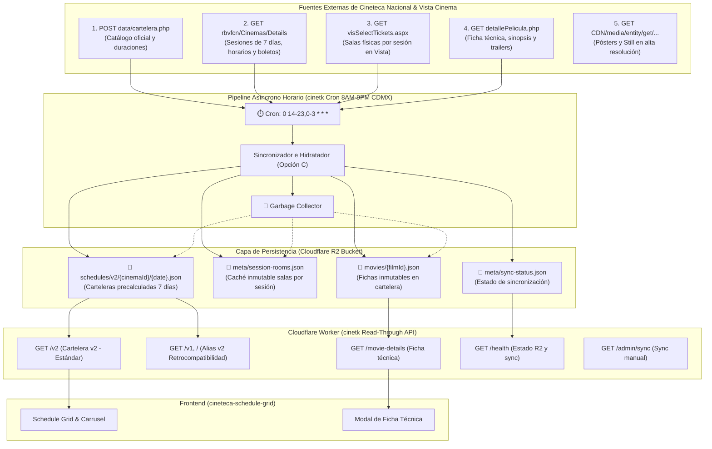

# Diccionario de Datos y Especificación de Endpoints: Cineteca Nacional, `cinetkv2` & `cinetk` (R2)

Este documento describe en detalle todas las fuentes de datos externas utilizadas por los Cloudflare Workers **`cinetkv2`** (Live Scraping Proxy) y **`cinetk`** (R2 Persistent & Cron Pipeline), los parámetros de consulta requeridos, la estructura de persistencia en Cloudflare R2 y los endpoints normalizados expuestos hacia el frontend de **Cineteca Schedule Grid**.

---

## 🗺️ Mapa General de Arquitectura de Datos



---

## 📡 Fuentes de Datos Externas (Endpoints de Origen)

### 1. Catálogo Oficial y Duraciones en Lote
* **URL:** `https://www.cinetecanacional.net/data/cartelera.php`
* **Método:** `POST`
* **Formato de Envío:** `application/x-www-form-urlencoded; charset=UTF-8`
* **Cabeceras Requeridas:**
  * `X-Requested-With: XMLHttpRequest`
  * `Referer: https://www.cinetecanacional.net/cartelera.php`
  * `User-Agent: Mozilla/5.0...`
* **Parámetros en el Body:**
  * `vista`: `full`
  * `fecha`: `YYYY-MM-DD` (ej. `2026-08-28`)
  * `cinema`: `000` (todas las sedes) o el código de sede (`001`, `002`, `003`)
  * `eventId`: `000`
* **Formato de Respuesta:** JSON que contiene un campo `html` con el render de tarjetas de la cartelera del día (~28 KB a 35 KB).

#### Datos Disponibles en esta Fuente:
| Campo | Tipo | Ejemplo | Descripción |
| :--- | :--- | :--- | :--- |
| `FilmId` | String | `HO00009798` | Identificador único universal de la película en el sistema Vista |
| `cinemas` | String | `001,002` | Lista separada por comas de sedes donde se proyecta la película |
| `Título en español` | String | `Adolescencia, sexo y muerte en Campamento Miasma` | Título oficial de exhibición en México |
| `Título original` | String | `Teenage Sex and Death at Camp Miasma` | Título en el idioma original |
| `Director` | String | `Jane Schoenbrun` | Nombre del director o directores |
| `País` | String | `Estados Unidos-Canadá` | País o países de producción |
| `Año` | String | `2026` | Año de producción de la película |
| `Duración exacta` | Number | `112` | Duración en minutos extraída de `Dur.: 112 mins.` |
| `Póster CDN` | String | `https://rbvfcn.../FilmPosterGraphic/HO00009798...` | URL directa a la miniatura de póster |

> **Lo que NO incluye:** Sinopsis completa, reparto de actores, ficha técnica extendida (música, fotografía, guion), horarios de función ni salas físicas.

---

### 2. Motor de Sesiones Semanales de Vista Ticketing
* **URL:** `https://rbvfcn.cinetecanacional.net/Browsing/Cinemas/Details/{cinemaId}`
* **Método:** `GET`
* **Identificadores de Sede (`cinemaId`):**
  * `001`: Cineteca Nacional Chapultepec (`CNCH`)
  * `002`: Cineteca Nacional de las Artes - Cenart (`CNA`)
  * `003`: Cineteca Nacional México - Xoco (`XOCO`)
* **Alcance Temporal:** Devuelve en **1 sola petición** (~120 KB a 180 KB) el catálogo completo de funciones para los **próximos 7 a 10 días**.

#### Datos Disponibles en esta Fuente:
| Campo | Selector / Expresión Regular | Ejemplo | Descripción |
| :--- | :--- | :--- | :--- |
| `data-movie-id` | `data-movie-id="([^"]+)"` | `HO00009798` | `FilmId` de cada película en exhibición |
| `Título` | `<h[23] class="film-title">` | `Adolescencia, sexo y muerte en Campamento Miasma` | Título registrado en el sistema de venta |
| `Fecha y Hora ISO` | `<time datetime="([^"]+)">` | `2026-08-28T16:15:00` | Marca de tiempo completa de cada función programada |
| `Hora Formateada` | Contenido de `<time>` | `04:15 p. m.` $\rightarrow$ `16:15` | Horario legible de inicio de función |
| `Enlace de Boletos` | `<a href="([^"]*visSelectTickets[^"]*)">` | `//rbvfcn.../visSelectTickets.aspx?txtSessionId=13912...` | URL directa al paso 1 de compra para ese horario |
| `txtSessionId` | Parámetro en `ticketUrl` | `13912` | ID numérico de la sesión de venta en Vista |
| `Póster CDN` | `` | `//rbvfcn.../FilmPosterGraphic/h-HO00009798...` | Imagen de cartelera |

> **Lo que NO incluye:** Nombres de las salas físicas de proyección ni sinopsis en texto plano.

---

### 3. Selector de Boletos y Extracción Inmutable de Salas Reales por Sesión (Vista - Opción C)
* **URL:** `https://rbvfcn.cinetecanacional.net/Ticketing/visSelectTickets.aspx?cinemacode={cinemaId}&txtSessionId={sessionId}&visLang=1&AspxAutoDetectCookieSupport=1`
* **Método:** `GET`
* **Cabeceras Requeridas:**
  * `Cookie: AspxAutoDetectCookieSupport=1` (Indispensable para evitar redirecciones cíclicas de ASP.NET)
  * `User-Agent: Mozilla/5.0...`
* **Propósito y Justificación Arquitectónica (Opción C):**
  En el sistema Vista Ticketing de Cineteca Nacional, **la sala física pertenece a la SESIÓN individual (`txtSessionId`) y no a la película**. Las películas cambian de sala entre distintos días de la semana (*Room Shifting*, caso comprobado: *Moscas* HO00009698 en Xoco pasa de Sala 10 el 3 de septiembre a Sala 9 el 4 de septiembre). Cada sesión tiene asignada una sala física 100% inmutable.
* **Mecanismo de Hidratación:**
  Las sesiones no presentes en `meta/session-rooms.json` se consultan concurrentemente en lotes de 15 peticiones en paralelo con `Promise.all()`.

#### Datos Extraídos por Sesión:
| Elemento Extraído | Selector / Criterio | Ejemplo | Asignación en el Grid y allShowtimes |
| :--- | :--- | :--- | :--- |
| **Sala Física Real** | `<div class="session-overview-line cinema-screen-name">` | `Cineteca Nacional Chapultepec - SALA 7 CNCH` | `sala: "7"`, `salaCompleta: "SALA 7 CNCH"` |
| **Funciones al Aire Libre / Entrada Libre** | Redirección `visError.aspx` o contenido `AltMessage=NoTickets` | `NoTickets` | `sala: "FORO AL AIRE LIBRE"`, `salaCompleta: "FORO AL AIRE LIBRE"` |

---

### 4. Ficha Técnica Detallada, Sinopsis y Trailer (Modal)
* **URL:** `https://www.cinetecanacional.net/detallePelicula.php?FilmId={filmId}&cinemaId=000`
* **Método:** `GET`
* **Propósito:** Proveer la información completa para el modal que se abre al dar clic en una película.

#### Datos Disponibles en esta Fuente:
| Campo | Ubicación en el HTML | Ejemplo |
| :--- | :--- | :--- |
| **Título** | `<div class="font-weight-bold text-uppercase h3">` | `Adolescencia, sexo y muerte en Campamento Miasma` |
| **Párrafo 1 (General)** | `<p class="lh-1">` | `(Teenage Sex and Death at Camp Miasma, Estados Unidos-Canadá, 2026, Dur.: 112 mins.)` |
| **Párrafo 2 (Créditos)** | `#collapseReseña .card-body p.lh-1` | `Director: Jane Schoenbrun. Guión: Jane Schoenbrun. Dir. Fotografía: Eric Yue. Con: Hannah Einbinder... Clasificación: C.` |
| **Párrafo 3 (Sinopsis)** | `#collapseReseña .card-body p.text-justify` | `Una joven directora tiene la tarea de revivir una saga slasher ochentera...` |
| **Trailer de YouTube** | `<iframe src="([^"]+youtube[^"]+)">` o `<a href="([^"]+youtu\.?be[^"]+)">` | `https://www.youtube.com/embed/dimCiC_hdoA?si=...` |
| **Póster Still** | `` | `https://rbvfcn.../FilmStill/HO00009798?referenceScheme=Cinema&allowPlaceHolder=true` |

---

### 5. CDN de Imágenes de Alta Definición (Vista CDN)
* **Póster Still (Horizontal / Modal):**  
  `https://rbvfcn.cinetecanacional.net/CDN/media/entity/get/FilmStill/{filmId}?referenceScheme=Cinema&allowPlaceHolder=true`
* **Póster Graphic (Vertical / Carrusel y Tarjetas):**  
  `https://rbvfcn.cinetecanacional.net/CDN/media/entity/get/FilmPosterGraphic/{filmId}?referenceScheme=Cinema&allowPlaceHolder=true`

---

## ⚡ Endpoints del Worker `cinetk` (Contratos JSON)

El Worker unifica todas las fuentes anteriores y expone los siguientes endpoints para el frontend:

### `GET /v2?cinemaId={id}&dia={YYYY-MM-DD}` (Estándar Canónico - Opción C)
Precalculado por el Cron Trigger mediante sesiones inmutables de Vista (`visSelectTickets.aspx`) y servido directamente desde Cloudflare R2 con latencia ultra baja (< 25 ms).

### `GET /v1?cinemaId={id}&dia={YYYY-MM-DD}` y `GET /` (Retrocompatibilidad)
Redirigen o sirven internamente el mismo payload generado por `v2` garantizando retrocompatibilidad transparente con clientes anteriores.

#### Esquema de Respuesta JSON (`/v2`):
```json
{
  "version": "v2",
  "source": "vista_session_rooms",
  "cinemaId": "001",
  "date": "2026-08-28",
  "total": 11,
  "data": [
    {
      "filmId": "HO00009798",
      "titulo": "Adolescencia, sexo y muerte en Campamento Miasma",
      "tipoVersion": "",
      "sala": "7",
      "salaCompleta": "SALA 7 CNCH",
      "horarios": [
        "16:15",
        "18:35"
      ],
      "allShowtimes": [
        {
          "date": "2026-08-28",
          "time": "16:15",
          "displayTime": "04:15 p. m.",
          "ticketUrl": "https://rbvfcn.cinetecanacional.net/Ticketing/visSelectTickets.aspx?cinemacode=001&txtSessionId=13912&visLang=1",
          "sessionId": "13912",
          "sala": "7",
          "salaCompleta": "SALA 7 CNCH",
          "sedeId": "001",
          "sede": "CHAPULTEPEC",
          "sedeCodigo": "CNCH"
        },
        {
          "date": "2026-08-28",
          "time": "18:35",
          "displayTime": "06:35 p. m.",
          "ticketUrl": "https://rbvfcn.cinetecanacional.net/Ticketing/visSelectTickets.aspx?cinemacode=001&txtSessionId=13913&visLang=1",
          "sessionId": "13913",
          "sala": "7",
          "salaCompleta": "SALA 7 CNCH",
          "sedeId": "001",
          "sede": "CHAPULTEPEC",
          "sedeCodigo": "CNCH"
        },
        {
          "date": "2026-08-29",
          "time": "16:15",
          "displayTime": "04:15 p. m.",
          "ticketUrl": "https://rbvfcn.cinetecanacional.net/Ticketing/visSelectTickets.aspx?cinemacode=001&txtSessionId=13950&visLang=1",
          "sessionId": "13950",
          "sala": "7",
          "salaCompleta": "SALA 7 CNCH",
          "sedeId": "001",
          "sede": "CHAPULTEPEC",
          "sedeCodigo": "CNCH"
        }
      ],
      "duracion": 112,
      "originalTitle": "Teenage Sex and Death at Camp Miasma",
      "director": "Jane Schoenbrun",
      "country": "Estados Unidos-Canadá",
      "year": "2026",
      "sedeId": "001",
      "sede": "CHAPULTEPEC",
      "sedeCodigo": "CNCH",
      "href": "detallePelicula.php?FilmId=HO00009798&cinemaId=000",
      "posterUrl": "https://rbvfcn.cinetecanacional.net/CDN/media/entity/get/FilmPosterGraphic/HO00009798?referenceScheme=Cinema&allowPlaceHolder",
      "ticketUrls": {
        "16:15": "https://rbvfcn.cinetecanacional.net/Ticketing/visSelectTickets.aspx?cinemacode=001&txtSessionId=13912&visLang=1",
        "18:35": "https://rbvfcn.cinetecanacional.net/Ticketing/visSelectTickets.aspx?cinemacode=001&txtSessionId=13913&visLang=1"
      }
    }
  ]
}
```

---

### `GET /movie-details?filmId={filmId}` (Ficha Técnica y Sinopsis)
Consulta y formatea la información detallada para el modal interactivo.

#### Esquema de Respuesta JSON:
```json
{
  "filmId": "HO00009798",
  "title": "Adolescencia, sexo y muerte en Campamento Miasma",
  "info": [
    "(Teenage Sex and Death at Camp Miasma, Estados Unidos-Canadá, 2026, Dur.: 112 mins.)",
    "Director: Jane Schoenbrun. Guión: Jane Schoenbrun. Con: Hannah Einbinder, Gillian Anderson... Clasificación: C.",
    "Una joven directora tiene la tarea de revivir una saga slasher ochentera. Movida por una profunda obsesión..."
  ],
  "generalInfo": "(Teenage Sex and Death at Camp Miasma, Estados Unidos-Canadá, 2026, Dur.: 112 mins.)",
  "credits": "Director: Jane Schoenbrun. Guión: Jane Schoenbrun...",
  "synopsis": "Una joven directora tiene la tarea de revivir una saga slasher ochentera...",
  "posterUrl": "https://rbvfcn.cinetecanacional.net/CDN/media/entity/get/FilmStill/HO00009798?referenceScheme=Cinema&allowPlaceHolder=true",
  "posterUrlLarge": "https://rbvfcn.cinetecanacional.net/CDN/media/entity/get/FilmStill/HO00009798?referenceScheme=Cinema&allowPlaceHolder=true",
  "trailerUrl": "https://www.youtube.com/embed/dimCiC_hdoA?si=AOh-70Wfa1dGHogQ"
}
```

---

### `GET /health` (Health Check)
```json
{
  "status": "ok",
  "worker": "cinetk",
  "architecture": "r2_persisted_cron_cache",
  "storage": "connected",
  "lastSync": "2026-09-03T18:00:00.000Z",
  "durationMs": 3420,
  "activeMoviesCount": 58,
  "activeDates": ["2026-09-03", "2026-09-04", "2026-09-05", "2026-09-06", "2026-09-07", "2026-09-08", "2026-09-09"],
  "totalSessionRooms": 412,
  "versions": ["v2"],
  "defaultVersion": "v2"
}
```

---

## 🗄️ Esquema de Persistencia en Cloudflare R2 (`cinetk`)

El worker `cinetk` utiliza un bucket R2 (`cinetk-storage`) como almacenamiento persistente estructurado:

| Clave / Prefijo en R2 | Formato | Propósito | Frecuencia de Actualización | Retención |
| :--- | :--- | :--- | :--- | :--- |
| `movies/{filmId}.json` | JSON | Ficha técnica completa, sinopsis, directores, país, año, póster y trailer. | Solo al descubrirse un nuevo `filmId` en cartelera (**Inmutable**). | Mientras esté activa en cartelera semanal. |
| `meta/session-rooms.json` | JSON | Caché inmutable consolidado de salas físicas por `sessionId` (Opción C). | Cada corrida del cron trigger (solo hidrata sesiones nuevas). | Las sesiones anteriores al día actual se purgan automáticamente. |
| `schedules/v2/{cinemaId}/{YYYY-MM-DD}.json` | JSON | Cartelera completa con salas de sesión para la sede y día. | Cada hora entre 8:00 AM y 9:00 PM CDMX. | Se purga cuando `date < hoy`. |
| `meta/sync-status.json` | JSON | Metadatos de la última corrida del cron, duración, IDs de películas activas y conteo. | Cada corrida del cron trigger. | Permanente (último estado). |

### 🧹 Política de Garbage Collection (Purga Automática):
En cada ejecución del cron trigger:
1. **Películas Fuera de Cartelera**: Se listan todas las claves `movies/*.json`. Si un `filmId` ya no tiene funciones en ninguna sede dentro de la ventana de 7 días, su archivo se elimina automáticamente de R2.
2. **Carteleras Pasadas**: Se listan las claves `schedules/*`. Cualquier fecha anterior al día actual es eliminada para conservar el bucket con un tamaño mínimo (< 500 KB).
3. **Sesiones Expiradas**: Se recorre `meta/session-rooms.json` y se eliminan todas las sesiones cuya fecha sea anterior a hoy, manteniendo el archivo liviano (< 50 KB).

---

## ⏱️ Comparativa de Rendimiento: Scraping en Vivo vs. R2 Persistent

| Métrica / Endpoint | `cinetkv2` (Scraping en Vivo) | `cinetk` (Persistencia R2) |
| :--- | :--- | :--- |
| **`/v1` (Cold Miss)** | ~1,200 ms | **15 - 25 ms** (Lee de R2) |
| **`/v2` (Cold Miss)** | ~1,800 ms | **15 - 25 ms** (Lee de R2) |
| **`/movie-details` (Cold Miss)** | ~350 ms | **10 - 20 ms** (Lee de R2) |
| **Edge Cache Hit** | 10 - 20 ms | **5 - 15 ms** |
| **Resiliencia ante caídas del upstream** | Falla si Cineteca se cae | **100% disponible** (Sirve último snapshot R2) |
| **Consumo de cuota / peticiones** | 1 por cada usuario | **14 corridas/día batch** (Mínimo impacto) |

