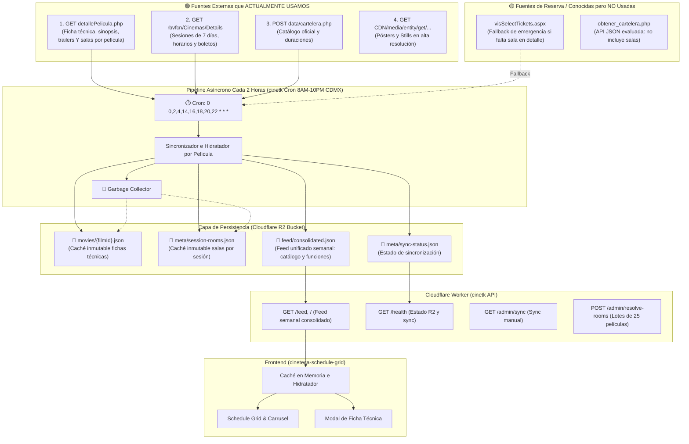

# Diccionario de Datos y Especificación de Endpoints: Cineteca Nacional, `cinetkv2` & `cinetk` (R2)

Este documento describe en detalle todas las fuentes de datos externas utilizadas por los Cloudflare Workers **`cinetkv2`** (Live Scraping Proxy) y **`cinetk`** (R2 Persistent & Cron Pipeline), los parámetros de consulta requeridos, la estructura de persistencia en Cloudflare R2 y los endpoints normalizados expuestos hacia el frontend de **Cineteca Schedule Grid**.

---

## 🗺️ Mapa General de Arquitectura de Datos


```mermaid
flowchart TD
    subgraph "🟢 Fuentes Externas que ACTUALMENTE USAMOS"
        F1["1. GET detallePelicula.php<br>(Ficha técnica, sinopsis, trailers Y salas por película)"]
        F2["2. GET rbvfcn/Cinemas/Details<br>(Sesiones de 7 días, horarios y boletos)"]
        F3["3. POST data/cartelera.php<br>(Catálogo oficial y duraciones)"]
        F4["4. GET CDN/media/entity/get/...<br>(Pósters y Stills en alta resolución)"]
    end

    subgraph "🟡 Fuentes de Reserva / Conocidas pero NO Usadas"
        FB1["visSelectTickets.aspx<br>(Fallback de emergencia si falta sala en detalle)"]
        FB2["obtener_cartelera.php<br>(API JSON evaluada: no incluye salas)"]
    end

    subgraph "Pipeline Asíncrono Cada 2 Horas (cinetk Cron 8AM-10PM CDMX)"
        Cron["⏱️ Cron: 0 0,2,4,14,16,18,20,22 * * *"]
        F1 & F2 & F3 --> Cron
        FB1 -. Fallback .-> Cron
        Cron --> Sync["Sincronizador e Hidratador por Película"]
        Sync --> GC["🧹 Garbage Collector"]
    end

    subgraph "Capa de Persistencia (Cloudflare R2 Bucket)"
        R2_MOV["📁 movies/{filmId}.json<br>(Caché inmutable fichas técnicas)"]
        R2_SES["📁 meta/session-rooms.json<br>(Caché inmutable salas por sesión)"]
        R2_FEED["📁 feed/consolidated.json<br>(Feed unificado semanal: catálogo y funciones)"]
        R2_META["📁 meta/sync-status.json<br>(Estado de sincronización)"]
    end

    Sync --> R2_MOV & R2_SES & R2_FEED & R2_META
    GC -.-> R2_MOV & R2_SES

    subgraph "Cloudflare Worker (cinetk API)"
        W_FEED["GET /feed, / (Feed semanal consolidado)"]
        W_HL["GET /health (Estado R2 y sync)"]
        W_ADM["GET /admin/sync (Sync manual)"]
        W_RES["POST /admin/resolve-rooms (Lotes de 25 películas)"]
    end

    R2_FEED --> W_FEED
    R2_META --> W_HL

    subgraph "Frontend (cineteca-schedule-grid)"
        UI_Store["Caché en Memoria e Hidratador"]
        UI_Grid["Schedule Grid & Carrusel"]
        UI_Modal["Modal de Ficha Técnica"]
    end

    W_FEED --> UI_Store
    UI_Store --> UI_Grid & UI_Modal
```

---

## 📡 Fuentes de Datos Externas (Endpoints de Origen)

### 🟢 Fuentes que ACTUALMENTE USAMOS en el Pipeline

#### 1. Ficha Técnica, Sinopsis, Trailer y Salas por Película
* **URL:** `https://www.cinetecanacional.net/detallePelicula.php?FilmId={filmId}&cinemaId=000`
* **Método:** `GET`
* **Cabeceras Requeridas:**
  * `User-Agent: Mozilla/5.0...`
* **Propósito y Justificación:**
  Es la **fuente más eficiente y rica del sistema**. En **1 sola petición** devuelve tanto los metadatos cinematográficos como **todas las sesiones programadas para los próximos 7 días en las 3 sedes (CNCH 001, CNA 002, XOCO 003)** con sus salas físicas asignadas en el bloque `#horarios`.
  - **Cobertura comprobada:** 100% de las funciones semanales en cartelera activa.
  - **Eficiencia:** 1 llamada por película resuelve entre 10 y 45 funciones a la vez, reduciendo las consultas de salas de ~800 a solo ~65 para toda la semana.
* **Datos Extraídos de esta Fuente:**
  | Elemento Extraído | Selector / Ubicación HTML | Ejemplo | Asignación en el Sistema |
  | :--- | :--- | :--- | :--- |
  | **Título** | `<div class="font-weight-bold text-uppercase h3">` | `Adolescencia, sexo y muerte en Campamento Miasma` | `title`, `titulo` |
  | **Párrafo 1 (General)** | `<p class="lh-1">` | `(Teenage Sex and Death at Camp Miasma, Estados Unidos-Canadá, 2026, Dur.: 112 mins.)` | `generalInfo` |
  | **Párrafo 2 (Créditos)**| `#collapseReseña .card-body p.lh-1` | `Director: Jane Schoenbrun. Guión: Jane Schoenbrun...` | `credits` |
  | **Párrafo 3 (Sinopsis)**| `#collapseReseña .card-body p.text-justify` | `Una joven directora tiene la tarea de revivir una saga slasher...` | `synopsis` |
  | **Trailer de YouTube**  | `iframe[src*="youtube"]` o `a[href*="youtu"]` | `https://www.youtube.com/embed/dimCiC_hdoA` | `trailerUrl` |
  | **Póster Still**        | `` | `https://rbvfcn.../FilmStill/HO00009798...` | `stillUrl`, `posterUrlLarge` |
  | **Salas por Sesión**    | Bloque `#horarios` (`<a href="*visSelectTickets*">`) | `SALA 3 Xoco`, `SALA 1 CNA`, `FORO AL AIRE LIBRE` | `sala`, `salaCompleta` en `sessionRooms` |

---

#### 2. Motor de Sesiones Semanales de Vista Ticketing
* **URL:** `https://rbvfcn.cinetecanacional.net/Browsing/Cinemas/Details/{cinemaId}`
* **Método:** `GET`
* **Identificadores de Sede (`cinemaId`):**
  * `001`: Cineteca Nacional Chapultepec (`CNCH`)
  * `002`: Cineteca Nacional de las Artes - Cenart (`CNA`)
  * `003`: Cineteca Nacional México - Xoco (`XOCO`)
* **Alcance Temporal:** Devuelve en **1 sola llamada por sede** (3 peticiones en total) el catálogo cronológico completo de funciones para los **próximos 7 a 10 días**.
* **Datos Extraídos de esta Fuente:**
  | Campo | Selector / Expresión Regular | Ejemplo | Descripción |
  | :--- | :--- | :--- | :--- |
  | `data-movie-id` | `data-movie-id="([^"]+)"` | `HO00009798` | `FilmId` universal de cada película en exhibición |
  | `Título` | `<h[23] class="film-title">` | `Adolescencia, sexo y muerte en Campamento Miasma` | Título registrado en taquilla |
  | `Fecha y Hora ISO` | `<time datetime="([^"]+)">` | `2026-08-28T16:15:00` | Marca de tiempo completa de inicio |
  | `Hora Formateada` | Contenido de `<time>` | `04:15 p. m.` $\rightarrow$ `16:15` | Horario legible 24h |
  | `txtSessionId` | Parámetro en `ticketUrl` | `13912` | ID numérico de venta en Vista |
  | `Enlace de Boletos` | `<a href="*visSelectTickets*">` | `https://rbvfcn.../visSelectTickets.aspx?txtSessionId=13912...` | URL de compra directa |
* **Lo que NO incluye:** Nombres de las salas físicas de proyección ni sinopsis en texto plano.

---

#### 3. Catálogo Oficial y Duraciones en Lote
* **URL:** `https://www.cinetecanacional.net/data/cartelera.php`
* **Método:** `POST`
* **Formato de Envío:** `application/x-www-form-urlencoded; charset=UTF-8`
* **Parámetros:** `vista=full&fecha=YYYY-MM-DD&cinema=000&eventId=000`
* **Propósito:** Obtener las duraciones oficiales exactas en minutos y metadatos de producción (director, país, año) para todas las películas proyectadas en el día consultado.
* **Datos Extraídos de esta Fuente:**
  | Campo | Tipo | Ejemplo | Descripción |
  | :--- | :--- | :--- | :--- |
  | `FilmId` | String | `HO00009798` | Identificador único de película |
  | `Director` | String | `Jane Schoenbrun` | Nombre del director o directores |
  | `País` | String | `Estados Unidos-Canadá` | País o países de producción |
  | `Año` | String | `2026` | Año de estreno |
  | `Duración exacta` | Number | `112` | Duración en minutos extraída de `Dur.: 112 mins.` |
  | `Póster CDN` | String | `https://rbvfcn.../FilmPosterGraphic/HO00009798...` | Miniatura oficial de cartelera |
* **Lo que NO incluye:** Salas físicas ni horarios de función.

---

#### 4. CDN de Imágenes de Alta Definición (Vista CDN)
* **Póster Still (Horizontal / Modal):**  
  `https://rbvfcn.cinetecanacional.net/CDN/media/entity/get/FilmStill/{filmId}?referenceScheme=Cinema&allowPlaceHolder=true`
* **Póster Graphic (Vertical / Carrusel y Tarjetas):**  
  `https://rbvfcn.cinetecanacional.net/CDN/media/entity/get/FilmPosterGraphic/{filmId}?referenceScheme=Cinema&allowPlaceHolder=true`

---

### 🟡 Fuentes CONOCIDAS que NO USAMOS actualmente (o sólo como reserva/fallback)

#### A. Selector de Boletos y Sala por Sesión Individual (`visSelectTickets.aspx`)
* **URL:** `https://rbvfcn.cinetecanacional.net/Ticketing/visSelectTickets.aspx?cinemacode={cinemaId}&txtSessionId={sessionId}&visLang=1&AspxAutoDetectCookieSupport=1`
* **Estado en la Arquitectura:** **Fallback de emergencia** (no se utiliza en la rutina horaria).
* **Por qué NO se usa rutinariamente:**
  - Requiere **1 petición HTTP por cada sesión individual** (~600 a 800 peticiones para cubrir la semana).
  - Excede con creces el límite de **50 subrequests** por ejecución del plan gratuito de Cloudflare Workers.
  - Se mantiene implementado en `fetchSingleSessionRoom` **únicamente como salvaguarda** por si una función atípica no apareciera en el bloque `#horarios` de `detallePelicula.php`.

#### B. API JSON de Cartelera (`obtener_cartelera.php`)
* **URL:** `https://www.cinetecanacional.net/obtener_cartelera.php?fecha={YYYY-MM-DD}&sede={cinemaId}`
* **Estado en la Arquitectura:** **Conocida y evaluada, pero descartada.**
* **Por qué NO se usa:**
  - Endpoint JSON descubierto al analizar el buscador alternativo de Cineteca (`ProyectoAlt/script.js`).
  - Devuelve JSON estructurado con `film_id`, títulos, sedes y un arreglo de `horarios: [{ hora, session_id }]`.
  - **Carece por completo de información de salas físicas** (`sala` o `screen`). Tampoco incluye duraciones exactas en minutos, sinopsis, ni trailers.
  - Al no incluir salas físicas, no aporta valor sobre `Browsing/Cinemas/Details` (que ya entrega las sesiones de 7-10 días en 1 sola llamada por sede).

#### C. Endpoints de Compra Rápida de Vista (`/Browsing/QuickTickets/*`)
* **URLs:**
  - `https://rbvfcn.cinetecanacional.net/Browsing/QuickTickets/Sessions`
  - `https://rbvfcn.cinetecanacional.net/Browsing/QuickTickets/Movies`
  - `https://rbvfcn.cinetecanacional.net/Browsing/QuickTickets/Cinemas`
* **Estado en la Arquitectura:** **Conocida y descartada.**
* **Por qué NO se usa:**
  - Requieren una cookie de sesión ASP.NET interactiva previa del navegador; de lo contrario, redirigen a la portada principal devolviendo HTML genérico en lugar de respuestas JSON consumibles.

---

## ⚡ Endpoints del Worker `cinetk` (Contratos JSON)

El Worker unifica todas las fuentes anteriores en un único payload consolidado y expone los siguientes endpoints:

### `GET /feed` y `GET /` (Feed Semanal Consolidado)
Servido directamente desde Cloudflare R2 con latencia ultra baja (< 25 ms). Contiene:
- **`activeDates`**: Lista ordenada de fechas disponibles (7-8 días).
- **`sedes`**: Información general de las sedes.
- **`movies`**: Catálogo de películas desduplicado con fichas técnicas completas, sinopsis, créditos, posters y tráilers.
- **`schedules`**: Funciones agrupadas por fecha y sede, con salas resueltas de forma inmutable por sesión.

#### Esquema de Respuesta JSON (`/feed`):
```json
{
  "version": "feed-v1",
  "generatedAt": "2026-09-08T01:00:56.565Z",
  "activeDates": [
    "2026-09-07",
    "2026-09-08",
    "2026-09-09",
    "2026-09-10",
    "2026-09-11",
    "2026-09-12",
    "2026-09-13"
  ],
  "sedes": {
    "001": { "nombre": "CHAPULTEPEC", "codigo": "CNCH" },
    "002": { "nombre": "CENART", "codigo": "CNA" },
    "003": { "nombre": "XOCO", "codigo": "XOCO" }
  },
  "totalMovies": 66,
  "totalSessions": 408,
  "movies": {
    "HO00009798": {
      "filmId": "HO00009798",
      "titulo": "Adolescencia, sexo y muerte en Campamento Miasma",
      "originalTitle": "Teenage Sex and Death at Camp Miasma",
      "duracion": 112,
      "director": "Jane Schoenbrun",
      "country": "Estados Unidos-Canadá",
      "year": "2026",
      "posterUrl": "https://rbvfcn.cinetecanacional.net/CDN/media/entity/get/FilmPosterGraphic/HO00009798?referenceScheme=Cinema&allowPlaceHolder",
      "stillUrl": "https://rbvfcn.cinetecanacional.net/CDN/media/entity/get/FilmStill/HO00009798?referenceScheme=Cinema&allowPlaceHolder=true",
      "trailerUrl": "https://www.youtube.com/embed/dimCiC_hdoA",
      "generalInfo": "(Teenage Sex and Death at Camp Miasma, Estados Unidos-Canadá, 2026, Dur.: 112 mins.)",
      "credits": "Director: Jane Schoenbrun. Guión: Jane Schoenbrun...",
      "synopsis": "Una joven directora tiene la tarea de revivir una saga slasher ochentera...",
      "info": [
        "(Teenage Sex and Death at Camp Miasma, Estados Unidos-Canadá, 2026, Dur.: 112 mins.)",
        "Director: Jane Schoenbrun. Guión: Jane Schoenbrun...",
        "Una joven directora tiene la tarea de revivir una saga slasher ochentera..."
      ]
    }
  },
  "schedules": {
    "2026-09-07": {
      "003": [
        {
          "filmId": "HO00009798",
          "sala": "7",
          "salaCompleta": "SALA 7 XOCO",
          "horarios": [
            "16:15",
            "18:35"
          ],
          "ticketUrls": {
            "16:15": "https://rbvfcn.cinetecanacional.net/Ticketing/visSelectTickets.aspx?cinemacode=003&txtSessionId=13912&visLang=1",
            "18:35": "https://rbvfcn.cinetecanacional.net/Ticketing/visSelectTickets.aspx?cinemacode=003&txtSessionId=13913&visLang=1"
          },
          "sessions": [
            {
              "sessionId": "13912",
              "time": "16:15",
              "displayTime": "04:15 p. m.",
              "ticketUrl": "https://rbvfcn.cinetecanacional.net/Ticketing/visSelectTickets.aspx?cinemacode=003&txtSessionId=13912&visLang=1",
              "sala": "7",
              "salaCompleta": "SALA 7 XOCO"
            },
            {
              "sessionId": "13913",
              "time": "18:35",
              "displayTime": "06:35 p. m.",
              "ticketUrl": "https://rbvfcn.cinetecanacional.net/Ticketing/visSelectTickets.aspx?cinemacode=003&txtSessionId=13913&visLang=1",
              "sala": "7",
              "salaCompleta": "SALA 7 XOCO"
            }
          ]
        }
      ]
    }
  }
}
```

---

### `GET /health` (Health Check)
```json
{
  "status": "ok",
  "worker": "cinetk",
  "architecture": "r2_consolidated_feed",
  "storage": "connected",
  "feedReady": true,
  "totalMoviesInFeed": 66,
  "totalSessionsInFeed": 408,
  "lastSync": "2026-09-08T01:00:56.565Z",
  "durationMs": 28730,
  "activeMoviesCount": 66,
  "activeDates": [
    "2026-09-07",
    "2026-09-08",
    "2026-09-09",
    "2026-09-10",
    "2026-09-11",
    "2026-09-12",
    "2026-09-13"
  ],
  "totalSessionRooms": 408,
  "endpoint": "/feed"
}
```

---

### `GET /admin/sync` (Sincronización Manual)
* **Método:** `GET` o `POST`
* **Autenticación:** Parámetro `?token={ADMIN_TOKEN}` o cabecera `Authorization: Bearer {ADMIN_TOKEN}` (si `ADMIN_TOKEN` está configurado en variables de entorno).
* **Comportamiento:** Dispara manualmente el pipeline completo de sincronización de 5 fases (scrapers upstream, cálculo de salas, consolidación de metadatos y escritura de `feed/consolidated.json` en R2).

---

### `POST /admin/resolve-rooms` (Resolución de Salas por Lote de Películas)
* **Método:** `POST` o `GET`
* **Autenticación:** Parámetro `?token={ADMIN_TOKEN}` o cabecera `Authorization: Bearer {ADMIN_TOKEN}`.
* **Comportamiento:** 
  1. Identifica las películas con sesiones semanales activas cuyas salas físicas aún no están en `meta/session-rooms.json`.
  2. Resuelve en paralelo un lote de hasta **25 películas** por invocación (cubriendo entre 250 y 350 sesiones por ejecución) para mantenerse siempre por debajo del límite de subrequests de Cloudflare Workers.
  3. Guarda el avance en R2.
  4. Para regeneración manual masiva en 1 solo paso de toda la semana (~650 sesiones), se utiliza el script `scripts/seed-rooms.mjs` o el workflow de GitHub Actions (`workflow_dispatch`), que completa la resolución en ~3-5 segundos.

---

### `GET /admin/test-telegram` (Prueba de Notificaciones)
* **Método:** `GET`
* **Autenticación:** Parámetro `?token={ADMIN_TOKEN}` o cabecera `Authorization: Bearer {ADMIN_TOKEN}`.
* **Comportamiento:** Envía un mensaje de prueba al chat de Telegram configurado en `TELEGRAM_CHAT_ID` mediante `TELEGRAM_BOT_TOKEN`.

---

## 🗄️ Esquema de Persistencia en Cloudflare R2 (`cinetk`)

El worker `cinetk` utiliza un bucket R2 (`cinetk-storage`) como almacenamiento persistente estructurado:

| Clave / Prefijo en R2 | Formato | Propósito | Frecuencia de Actualización | Retención |
| :--- | :--- | :--- | :--- | :--- |
| `feed/consolidated.json` | JSON | Feed semanal consolidado único: catálogo de películas y funciones de 7-8 días para las 3 sedes. | Cada 2 horas entre 8:00 AM y 10:00 PM CDMX. | Permanente (último snapshot). |
| `movies/{filmId}.json` | JSON | Ficha técnica inmutable de respaldo y caché del scraper (sinopsis, créditos, posters, trailer). | Solo al descubrirse un nuevo `filmId` en cartelera (**Inmutable**). | Mientras esté activa en cartelera semanal. |
| `meta/session-rooms.json` | JSON | Caché inmutable consolidado de salas físicas por `sessionId` (Opción C). | Cada corrida del cron trigger (solo hidrata sesiones nuevas). | Las sesiones anteriores al día actual se purgan automáticamente. |
| `meta/sync-status.json` | JSON | Metadatos de la última corrida del cron, duración, IDs de películas activas y conteo. | Cada corrida del cron trigger. | Permanente (último estado). |

### 🧹 Política de Garbage Collection (Purga Automática):
En cada ejecución del cron trigger:
1. **Películas Fuera de Cartelera**: Se listan todas las claves `movies/*.json`. Si un `filmId` ya no tiene funciones en ninguna sede dentro de la ventana de 7 días, su archivo se elimina automáticamente de R2.
2. **Sesiones Expiradas**: Se recorre `meta/session-rooms.json` y se eliminan todas las sesiones cuya fecha sea anterior a hoy, manteniendo el archivo liviano (< 50 KB).

---

## ⏱️ Comparativa de Rendimiento: Scraping en Vivo vs. Feed Consolidado R2

| Métrica / Endpoint | `cinetkv2` (Scraping en Vivo) | `cinetk` (Feed Consolidado R2) |
| :--- | :--- | :--- |
| **Carga inicial completa (Modo Películas)** | ~3,500 - 6,000 ms (24 peticiones HTTP concurrentes) | **20 - 80 ms** (1 sola petición `/feed` de ~35 KB) |
| **Navegación entre días (Calendario)** | ~1,200 ms por fecha/sede | **0 ms** (Instantáneo, todo en memoria) |
| **Apertura y navegación de Fichas (Modal)** | ~350 ms por película | **0 ms** (Precargado en memoria) |
| **Peticiones HTTP por sesión de usuario** | 25 a 50+ peticiones | **1 sola petición** |
| **Edge Cache Hit** | 10 - 20 ms | **5 - 15 ms** |
| **Resiliencia ante caídas del upstream** | Falla si Cineteca se cae | **100% disponible** (Sirve último snapshot R2) |


